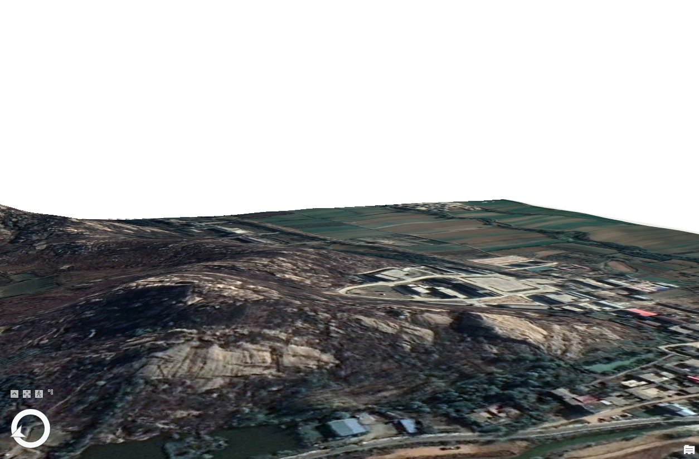

# Overview

This script uses google maps elevation api to get a ArcGIS formatted DEM of specified region.

# How-to-use

## Get Google Earth API key

https://console.cloud.google.com/google/maps-apis/credentials

## Install ArcGIS Pro 2.7 or greater

## Setting up environment

In ArcGIS Pro => Settings => Package Manager => Environment Manager, clone the default environment and activate.

## Modify script

In the file 'construct.py' modify your target position and goole api key.

## Run

In Start Menu => ArcGIS => Python Command Prompt, execute the following commands:

```bash
cd <your folder>
pip install -r requirements.txt
python construct.py
```


Finally, the result is in <your folder>/output.

# Best practice



# Read Before use

- The script uses WGS-84 system.
- Results are not 100% precise.